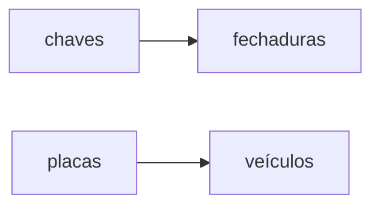

# Funções: definição, domínio, contradomínio e imagem.

## Introdução 

Antes de mais nada, precisamos nos situar. Eu assumo que vocês já tenham algum conhecimento de teoria dos conjuntos: noção intuitiva do que é um conjunto, o que significa dizer que um elemento pertence a um conjunto. 

Dado que sabemos o que é um conjunto, podemos falar de funções. Funções nada mais são do que associações feitas entre elementos de diferentes conjuntos. Você associa um elemento de um conjunto A com um elemento de um conjunto B e tudo certo. 

Sem adentrar no mundo matemático, podemos pensar em uma função associando cada elemento de um conjunto de chaves a um elemento de um conjunto de fechaduras. Ou também associando cada elemento de um conjunto de placas de veículos a um elemento de um conjunto de veículos. 

Podemos pensar então em algo como

Em notação matemática, usamos a notação $$f:A\to B$$ para representar uma função de nome $f$ que associa elementos do conjunto $A$ a elementos do conjunto $B$.

Na notação acima, chamamos o conjunto $A$ de **domínio** da função $f$ e o conjunto $B$ de **contradomínio**.

## Formalizando

Uma função é uma relação de um conjunto $A$ num conjunto $B$ tal que cada elemento de $A$ está associado a um único elemento de $B$.

**Exemplo 1A: Condomínio Jambalaia**

O seriado Toma Lá, Dá Cá se passa no fictício Condomínio Jambalaia. Considere $A$ o conjunto de pessoas que mora nesse condomínio e considere $B$ o conjunto dos apartamentos desse condomínio. Associe a cada pessoa de $A$ o apartamento que ela reside em $B$. Essa associação é uma função pois:
 - Cada pessoa de $A$ mora necessariamente em um apartamento de $B$. 
 - Exceto em casos absurdos, nenhuma pessoa mora em dois apartamentos. 

**Exemplo 1B**

Considere novamente o conjunto $A$ do exemplo acima. Podemos tentar definir uma função de $A$ em $A$, pela seguinte relação: associamos a cada elemento de $A$ o seu filho. Isso não permite definir uma função pois
- Existem pessoas que não possuem filhos
- Existem pessoas que até possuem filhos, mas eles não pertencem ao conjunto $A$
- Existem pessoas que possuem mais de um filho que pertencem ao conjunto $A$

**Exemplo 2: Veículos**

Vamos pensar em veículos. Considere $A$ o conjunto de todas as placas de veículos e $B$ o conjunto de todos os veículos que existem no Brasil. Podemos associar a cada placa o seu veículo correspondente e obtemos uma função, pois:
- Cada placa corresponde a um único veículo (desconsiderando os veículos clonados)
- Um veículo não pode ter duas placas distintas

 
## Imagem

A imagem de uma função é o conjunto de todos os elementos do contradomínio que estão associados a algum elemento do domínio.

 - No Exemplo 1, a imagem da função é o conjunto de todos os apartamentos em que mora alguém. 
 - No Exemplo 2, a imagem da função é o conjunto de todos os veículos emplacados (ou seja, veículos zero km não estão na imagem da função)