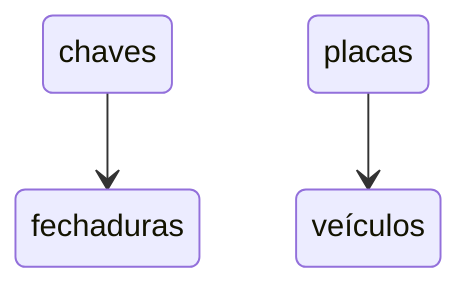

# Funções: definição, domínio, contradomínio e imagem.

Antes de mais nada, precisamos nos situar. Eu assumo que vocês já tenham algum conhecimento de teoria dos conjuntos: noção intuitiva do que é um conjunto, o que significa dizer que um elemento pertence a um conjunto. 

Dado que sabemos o que é um conjunto, podemos falar de funções. Funções nada mais são do que associações feitas entre elementos de diferentes conjuntos. Você associa um elemento de um conjunto A com um elemento de um conjunto B e tudo certo. 

Sem adentrar no mundo matemático, podemos pensar em uma função associando cada elemento de um conjunto de chaves a um elemento de um conjunto de fechaduras. Ou também associando cada elemento de um conjunto de placas de veículos a um elemento de um conjunto de veículos. 

Podemos pensar então em algo como

